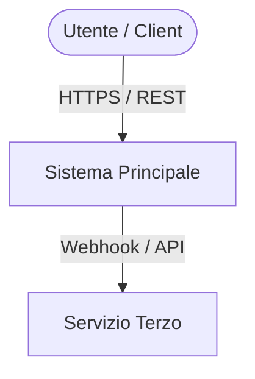
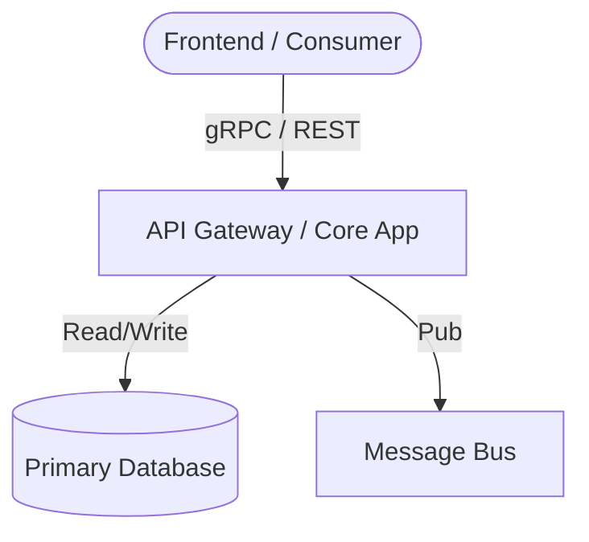

> ℹ️ **Skill in esecuzione**: `architecture-design`
> *Questa skill si è attivata per guidare l'operazione corrente.*

**REGOLA DI OUTPUT OBBLIGATORIA**: Quando questa skill è attiva, includi SEMPRE all'inizio della tua risposta il blocco di callout soprastante.

# Architecture Design

Il valore di un sistema software si decide prima di scrivere codice. Un'architettura debole trasferisce la propria ambiguità a ogni strato applicativo successivo, amplificando il debito tecnico a ogni iterazione agentica. Questa skill definisce l'architettura che un Principal/Senior Architect redige prima di autorizzare lo scaffolding: componenti, confini di dominio e decisioni difese da trade-off espliciti.

## Principio Fondamentale

Un'architettura non è un catalogo di tecnologie: è una rete di **decisioni con trade-off** (Neal Ford & Mark Richards, *Fundamentals of Software Architecture*). Ogni proposta deve esplicitare cosa si guadagna e cosa si sacrifica rispetto alle alternative scartate.

### Euristica di Pragmatismo (Anti-Microservice Bias)
- **Monolite Modulare come default**: progettare moduli logici con confini profondi e interfacce minime (Ousterhout, *A Philosophy of Software Design*).
- **Separazione distribuita solo su evidenza**: microservizi o architetture a eventi sono ammessi solo in presenza di asimmetrie estreme di carico, vincoli di compliance/fault-isolation o team distribuiti (Legge di Conway).

## Contratto di Input/Output

- **Input**: Idea di progetto, requisiti di business, vincoli noti (budget, SLO/SLA, team, compliance). Se i dati sono parziali, **non arrestare l'esecuzione**: dichiara le assunzioni minime necessarie e procedi.
- **Output**: Documento architetturale puro. **Divieto assoluto di scrivere codice applicativo o boilerplate** (delegato a `master-hexagonal-architecture` o alla normale modalità dev).

Deve includere:
1. Attributi di qualità prioritari (metodo ADD/SEI).
2. Domini e Bounded Context (DDD).
3. Diagrammi C4 (Context e Container) renderizzati in blocchi `mermaid`.
4. Stack tecnologico con trade-off e alternative scartate.
5. Architecture Decision Records (ADR formato Nygard).
6. Matrice rischi, failure modes e mitigazioni (ATAM).
7. Piano evolutivo (fitness functions).

## Metodologia Operativa

1. **Attributi di Qualità (ADD)**: Individuare le 3 proprietà non negoziabili del sistema (es. latenza p99, disponibilità, manutenibilità).
2. **Decomposizione del Dominio (DDD - Evans)**: Mappare i confini logici e il linguaggio ubiquo prima delle scelte di storage o protocolli.
3. **Livelli C4 (Simon Brown)**:
   - *Level 1 (System Context)*: Attori, confini del sistema e integrazioni esterne.
   - *Level 2 (Containers)*: Applicazioni, microservizi/monolite, datastore, canali di messaggistica e protocolli di comunicazione.
4. **Stack & Trade-off**: Matrice decisionale comparativa (scelta vs scartata vs costo/limite).
5. **ADR Formale (Nygard)**: Contesto, Decisione, Conseguenze (positive e negative).
6. **Stress-Test & Single Point of Failure (ATAM/Well-Architected)**: Valutare partizionamento di rete, failover DB e colli di bottiglia su storage.
7. **Moduli Profondi (Ousterhout)**: Pochi componenti con interfacce contrattuali semplici e logica interna ricca; vietata la frammentazione anemica.

## Template di Output

```markdown
# Architettura di Sistema: [Nome Progetto]

## 1. Requisiti & Attributi di Qualità (ADD)
- Obiettivi di Business & Vincoli: ...
- Attributi di Qualità Critici (Top 3): ...
- Assunzioni Adottate: ...

## 2. Domini & Bounded Context (DDD)
- [Bounded Context A]: Responsabilità principale, linguaggio ubiquo, confini.
- [Bounded Context B]: ...
- Mappa delle Relazioni (Upstream/Downstream, Customer/Supplier): ...

## 3. Modello C4 & Topologia dei Componenti

### 3.1 C4 - System Context (L1)


### 3.2 C4 - Container Architecture (L2)


## 4. Stack Tecnologico & Matrice Trade-off
| Componente | Scelta | Alternativa Scartata | Beneficio Chiave | Costo / Limite Accettato |
|---|---|---|---|---|
| Runtime | ... | ... | ... | ... |
| Storage | ... | ... | ... | ... |

## 5. Architecture Decision Records (ADR)
### ADR-001: [Titolo Decisione]
- **Status**: Approvato
- **Contesto**: [Perché serve questa decisione]
- **Decisione**: [Cosa abbiamo scelto di adottare]
- **Conseguenze**: [Upside e downside certi]

## 6. Failure Modes, SPoF & Mitigazioni (ATAM)
| Componente Critico | Scenario di Guasto | Rischio Sistemico | Strategia di Mitigazione |
|---|---|---|---|
| ... | ... | ... | ... |

## 7. Piano di Evoluzione & Fitness Functions
- Punti di rottura previsti (es. volume transazioni 10x): ...
- Direttive di scalabilità e disaccoppiamento: ...
```

## Precedenza Operativa (Gate 3)
Questa skill termina con la consegna del blueprint architetturale. Le fasi successive passano il controllo a:
- `master-hexagonal-architecture` per lo scaffolding e l'implementazione del core domain;
- `cloud-and-distributed-architecture` per transaction outbox, kafka e coerenza eventuale;
- `docker-compose-patterns` per la definizione dei manifest locali.

## Checklist di Validazione dell'Output

- [ ] Requisiti e attributi di qualità (ADD) raccolti o assunti esplicitamente.
- [ ] Domini e bounded context individuati con linguaggio ubiquo.
- [ ] Diagrammi C4 L1 e L2 generati in sintassi Mermaid valida.
- [ ] Stack tecnologico analizzato con almeno una alternativa scartata per componente critico.
- [ ] Decisioni strutturali documentate in formato ADR (contesto, decisione, conseguenze).
- [ ] SPoF e failure modes censiti con contromisure tecniche.
- [ ] Nessun codice applicativo generato all'interno del deliverable.
