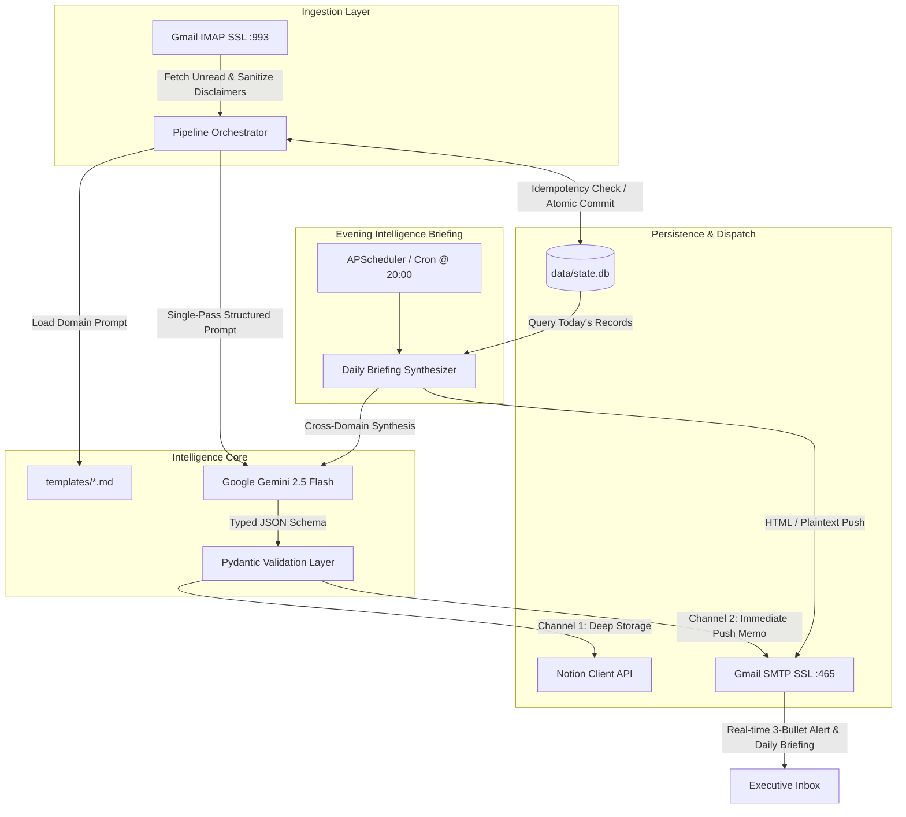

# Newsletter_Reader — Production-Grade Newsletter Intelligence Engine

[](https://www.python.org/)
[](https://www.docker.com/)
[](https://ai.google.dev/)
[](https://developers.notion.com/)
[](https://opensource.org/licenses/MIT)
[](#)

> **Headless, config-driven newsletter intelligence engine. Ingests newsletters via IMAP, executes single-pass structured extraction into Notion databases, and pushes real-time 3-bullet executive memos + cumulative daily briefings straight to your inbox.**

---

## 1. Executive Summary & Core Value

High-value newsletters contain critical industry signals, but traditional handling workflows inevitably suffer from two failure modes:

1. **The Passive Archive Trap:** Ingesting newsletters directly into Notion databases creates an unread knowledge repository. The information is cataloged but disconnected from active daily decision-making.
2. **Workstation Overhead & Focus Disruption:** Running separate automation scripts or heavy 24/7 background containers on developer laptops consumes 1.5–3 GB of RAM (e.g. WSL2 VM idle footprint) and frequently interrupts focus with background terminal prompts or GUI windows.

**Newsletter_Reader** resolves both constraints through an industrial, decoupled architecture:
* **Dual-Channel Single-Pass Inference:** A single Google Gemini 2.5 Flash call generates structured Pydantic payloads for both deep hierarchical Notion blocks and an immediate **3-bullet executive memo** (Key Fact, Underlying Dynamics, Strategic Action) delivered straight to the operator's primary inbox.
* **Cumulative Evening Intelligence Briefing:** At 20:00, the system scans all newsletters processed throughout the day and generates a cross-domain executive briefing email linking directly to the created Notion pages.
* **Dual-Mode Zero-Footprint Runtime:** Operates natively on Windows workstations as an invisible background daemon (`pythonw.exe`) with **0 MB idle RAM footprint**, while maintaining a full production-ready Docker container for VPS, Linux, or Cloud Run deployments.

---

## 2. System Architecture



### Key Engineering Guardrails
* **Deterministic Single-Pass Parsing:** Avoids running separate LLM calls for Notion pages and email digests. Token consumption and API latency are cut by **50%**, ensuring 100% semantic consistency between your inbox alert and Notion page.
* **Zero-Trust Idempotency:** Emails are uniquely identified by RFC 2822 `Message-ID` in a local transactional SQLite store (`data/state.db`). Network drops or repeated runs will never create duplicate Notion pages or duplicate email alerts.
* **Resilient Rate-Limit Handling:** Hard HTTP 429 quota exhaustion events trigger an immediate, graceful fail-fast termination (preserving unread status for subsequent runs), while transient HTTP 503 / 500 server errors invoke exponential backoff retry policies.

---

## 3. End-to-End Setup Guide

Follow this step-by-step procedure to configure all credentials and services.

### Step 1: Google Gemini API Key
1. Access [Google AI Studio](https://aistudio.google.com/).
2. Sign in with your Google account and click **Get API key** $\rightarrow$ **Create API key**.
3. Copy the generated key and assign it to `GEMINI_API_KEY` in your `.env` file.
> The engine is optimized for `gemini-2.5-flash`, providing fast inference and high structured schema compliance within the free-tier rate limits.

---

### Step 2: Notion API Integration & Database Setup
1. **Create an Internal Integration:**
   * Go to [Notion Developers / Integrations](https://www.notion.com/profile/integrations).
   * Click **New integration**, name it (e.g. `Newsletter Reader Engine`), and select your target workspace.
   * Under Capabilities, ensure **Read content**, **Update content**, and **Insert content** are checked.
   * Copy the **Internal Integration Secret** (`secret_...`) and paste it as `NOTION_TOKEN` in your `.env`.

2. **Prepare Target Notion Databases:**
   * In Notion, create a dedicated database (full page or inline table) for each newsletter domain.
   * **Mandatory Database Schema:** Each database must contain at least the following two native properties:
     * `Name` (Property Type: **Title**) — Used for the synthesized executive headline.
     * `Received` (Property Type: **Date**) — Used for the original email publication timestamp.
   * *(Optional)* Additional custom properties can exist alongside these without conflict.

3. **Grant Integration Access (Critical Step):**
   * Open the target database in Notion.
   * Click the `...` menu in the top-right corner $\rightarrow$ scroll to **Connections** (or **Add connections**) $\rightarrow$ search and select your integration (`Newsletter Reader Engine`).
   * *If this step is skipped, the Notion API will reject requests with an `object_not_found` (HTTP 404/403) error.*

4. **Extract Database IDs:**
   * In your browser, open the target database and copy its URL:
     ```text
     https://www.notion.so/myworkspace/3eeb63e859c880699ee9f58eae7066d6?v=3eeb63e859c8804ca381000c0928488b
                                        ^^^^^^^^^^^^^^^^^^^^^^^^^^^^^^^^
     ```
   * The 32-character hexadecimal string before `?v=` is your `database_id`. Specify it directly in `config/domains.yaml` or as an environment variable in `.env`.

---

### Step 3: Gmail IMAP & SMTP Credentials
1. **Enable 2-Step Verification:** Ensure your Google Account has 2-Step Verification enabled under [Google Account Security](https://myaccount.google.com/security).
2. **Generate an App Password:**
   * Under Security $\rightarrow$ 2-Step Verification $\rightarrow$ scroll down to **App passwords**.
   * Create a new App Password with a custom label (e.g. `Newsletter-Reader`).
   * Copy the generated 16-character password (e.g. `abcd efgh ijkl mnop`).
3. **Verify IMAP is Enabled in Gmail:**
   * In Gmail, go to **Settings** (gear icon) $\rightarrow$ **See all settings** $\rightarrow$ **Forwarding and POP/IMAP**.
   * Under "IMAP access", ensure **Enable IMAP** is selected and save changes.
4. **Set Environment Variables:**
   ```bash
   GMAIL_USER=your.account@gmail.com
   GMAIL_APP_PASSWORD=abcdefghijklmnop
   DIGEST_RECIPIENT=your.account@gmail.com
   ```

---

## 4. Multi-Domain Configuration (`config/domains.yaml`)

Adding or updating newsletters requires **zero code changes**. Each newsletter is declared in `config/domains.yaml`:

```yaml
version: "1.0"

global:
  imap_server: "imap.gmail.com"
  imap_port: 993
  smtp_server: "smtp.gmail.com"
  smtp_port: 465
  max_retries: 3
  inter_email_delay_seconds: 5.0
  db_path: "data/state.db"

daily_briefing:
  enabled: true
  schedule:
    cron: "0 20 * * *"             # Daily evening briefing at 20:00 (Europe/Rome)
    timezone: "Europe/Rome"
  subject_prefix: "[DAILY BRIEFING]"
  prompt_template: "templates/daily_briefing.md"

domains:
  - id: "executive_strategy"
    display_name: "Executive Strategy & Frameworks"
    enabled: true
    schedule:
      cron: "0 18 * * *"
      timezone: "Europe/Rome"
    filter:
      sender: "strategy@enterprise-insights.com"
      stop_string: "Unsubscribe or update preferences"
    ai:
      model: "gemini-2.5-flash"
      prompt_template: "templates/business_strategy.md"
      schema_type: "business_framework"
    notion:
      database_id: "your_notion_database_id_32_chars"
      layout_type: "framework_table"
    digest:
      enabled: true
      subject_prefix: "[STRATEGY MEMO]"
```

### Supported Notion Layout Sinks

| Layout Type | Schema Model | Notion Block Architecture | Target Use Cases |
| :--- | :--- | :--- | :--- |
| `bullet_metrics` | `QuantitativeMetricsPayload` | Hierarchical callout blocks with bold statistical metrics, historical delta, and market impact drivers. | Macroeconomic research, demographic analysis, central bank dispatches, FX data. |
| `editorial_sections` | `JournalisticEditorialPayload` | Multi-section journalistic briefings organized by thematic anchors (Market Movements, Deep Focus, Tactical Signals, Bottom Line). | Sector intelligence, fintech pulses, geopolitical summaries, crypto/commodities dispatches. |
| `framework_table` | `BusinessFrameworkPayload` | Analytical breakdown paired with a structured 2-column Scenario/Action strategy table. | Executive strategy memos, operational playbooks, management consulting, M&A breakdowns. |

---

## 5. Deployment Options

### Option A: Local Zero-RAM Execution (Windows Workstations)

Recommended for personal developer workstations. Consumes **0 MB RAM in idle state**.

```powershell
# 1. Bootstrap Python 3.11 virtual environment and install dependencies
.\scripts\bootstrap_env.ps1

# 2. Validate configuration and verify all prompt templates exist
.\.venv\Scripts\python.exe -m src.cli validate-config

# 3. Test execution in dry-run mode (validates IMAP and Gemini without remote writes)
.\.venv\Scripts\python.exe -m src.cli run --domain executive_strategy --dry-run

# 4. Ingest recent read newsletters from inbox (backfill mode)
.\.venv\Scripts\python.exe -m src.cli run --domain executive_strategy --include-seen --limit 5

# 5. Generate and dispatch the cumulative Daily Intelligence Briefing manually
.\.venv\Scripts\python.exe -m src.cli daily-briefing --dry-run  # Console preview
.\.venv\Scripts\python.exe -m src.cli daily-briefing            # Send email briefing

# 6. Register silent background Task Scheduler daemon (runs invisibly at system boot)
powershell -ExecutionPolicy Bypass -File .\scripts\register_startup_task.ps1
```

---

### Option B: Production Container (Docker)

Ideal for VPS, Raspberry Pi, Linux servers, or continuous cloud containers.

```bash
# 1. Build and start the background daemon
docker compose up -d --build

# 2. Monitor real-time logs
docker compose logs -f
```

---

## 6. CLI Command Reference

The CLI entrypoint (`src.cli`) provides full control over the ingestion engine:

```text
Usage: python -m src.cli [COMMAND] [OPTIONS]

Commands:
  validate-config   Check syntax of domains.yaml and verify that prompt templates exist.
  run               Execute ingestion for one or all configured domains.
  daily-briefing    Synthesize all newsletters processed today into an executive briefing.
  daemon            Start the blocking APScheduler cron daemon.

Options for 'run':
  --domain TEXT     Process a specific domain ID (default: all enabled domains).
  --dry-run         Execute parsing and LLM inference without writing to Notion or sending emails.
  --include-seen    Include previously opened/read emails (essential for backfilling historical issues).
  --limit INTEGER   Cap the maximum number of emails processed per domain.
```

---

## 7. Verification & Automated Tests

A comprehensive test suite guarantees schema validity, config parsing, template existence, and SQLite idempotency:

```powershell
.\.venv\Scripts\pytest.exe -v
```

```text
tests/test_config.py::test_load_yaml_config PASSED                       [ 12%]
tests/test_config.py::test_templates_exist PASSED                        [ 25%]
tests/test_daily_briefing.py::test_briefing_schema_validation PASSED     [ 37%]
tests/test_daily_briefing.py::test_daily_briefing_empty_state PASSED     [ 50%]
tests/test_engine.py::test_sqlite_store_idempotency PASSED               [ 62%]
tests/test_schemas.py::test_quantitative_schema PASSED                   [ 75%]
tests/test_schemas.py::test_crypto_editorial_schema PASSED               [ 87%]
tests/test_schemas.py::test_mozi_framework_schema PASSED                 [100%]
============================== 8 passed in 0.25s ==============================
```

---

## 8. Author & License

**Francesco Colombini**  
* GitHub: [@FRA-0023](https://github.com/FRA-0023)  
* LinkedIn: [Francesco Colombini](https://www.linkedin.com/in/francescocolombini/)

Distributed under the **MIT License**. See [`LICENSE`](LICENSE) for complete terms.
