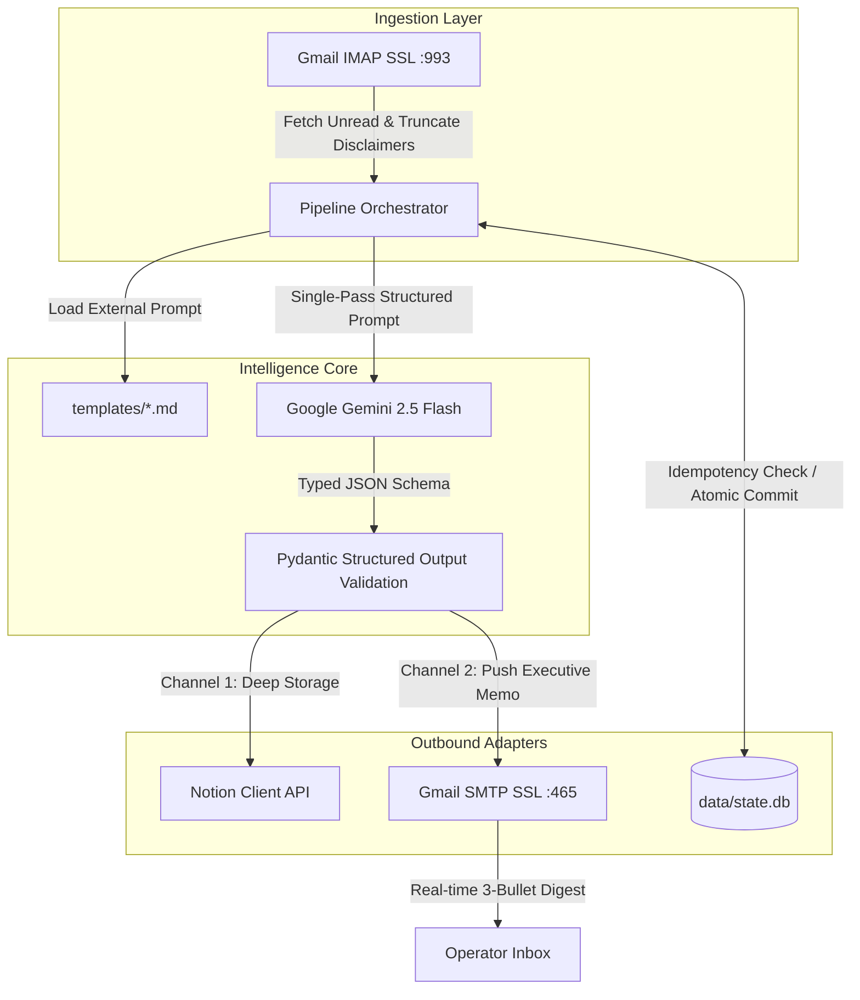

# Newsletter_Reader — Autonomous Dual-Mode Newsletter Ingestion Engine

[](https://www.python.org/)
[](https://www.docker.com/)
[](https://ai.google.dev/)
[](https://developers.notion.com/)
[](https://opensource.org/licenses/MIT)

> **Autonomous, headless, and config-driven pipeline transforming incoming email newsletters into structured Notion knowledge repositories and pushing real-time 3-bullet executive memos directly to the operator's inbox.**

---

## 1. Executive Summary & Problem Framing

Automated newsletter processing workflows commonly collapse under two structural flaws:

1. **The Silent Archive Dilemma:** Ingesting high-signal newsletters into Notion databases creates a passive knowledge graveyard. Information is archived but rarely resurfaced or consumed in the operational flow.
2. **Infrastructure Bloat & Focus-Stealing:** Scaling $N$ newsletters across independent scripts and Docker containers on desktop workstations leads to window-grabbing GUI prompts, excessive RAM consumption (1.5–3 GB WSL2 VMs running 24/7 for 30 seconds of daily compute), and maintenance friction.

**Newsletter_Reader** solves both through a decoupled, deterministic architecture:
- **Dual-Channel Single-Pass Extraction:** A single LLM inference call generates both deep, rich structured blocks for Notion storage and an ultra-minimal **3-bullet executive memo** (Fact, Dynamics, Strategic Action) pushed immediately via SMTP to the operator's inbox.
- **Dual-Mode Execution (Zero-RAM vs. Turnkey Docker):** Seamlessly toggles between a 100% headless, zero-RAM native Windows background daemon (`pythonw.exe` sleeping with 0 MB idle overhead) and an isolated multi-platform Docker container (`docker compose up -d`) ready for serverless, VPS, or cloud deployments.

---

## 2. System Architecture & Component Topology

The system adheres to Clean Architecture and the 12-Factor methodology. Domain business logic is completely decoupled from execution runtime and prompt assets.



### Architectural Pillars

- **Zero-Drift Single-Pass Inference:** Instead of running two separate LLM passes (one for Notion notes and one for email digests), Gemini generates a unified Pydantic schema in a single request. This reduces API overhead and token cost by **50%** while enforcing strict semantic synchronization between the email alert and the Notion page.
- **Resilient Network Backoff:** Built-in error interceptors gracefully handle HTTP `429` (Quota / Resource Exhausted) with dedicated bucket-replenishment sleep delays and HTTP `503` (Transient Service Unavailable) with exponential backoff.
- **Deterministic Storage Idempotency:** Each email is tracked via RFC 2822 `Message-ID` in a local transactional SQLite store (`data/state.db`) before modifying remote state, guaranteeing zero duplicate Notion pages across transient network drops.

---

## 3. Config-Driven Multi-Domain Engine (`domains.yaml`)

Adding a new newsletter requires **zero code changes**. Each newsletter is declared as an isolated domain entry in `config/domains.yaml`:

```yaml
domains:
  - id: "tristan_burns"
    display_name: "Tristan Burns Newsletter"
    enabled: true
    schedule:
      cron: "0 18 * * *"             # Daily at 18:00 (Europe/Rome)
      timezone: "Europe/Rome"
    filter:
      sender: "trisjburns@mail.beehiiv.com"
      stop_string: "Update your email preferences or unsubscribe"
    ai:
      model: "gemini-2.5-flash"
      prompt_template: "templates/tristan_burns.md"
      schema_type: "business_framework"
    notion:
      database_env_key: "NOTION_DB_TRISTAN_BURNS"
      layout_type: "framework_table"
    digest:
      enabled: true
      subject_prefix: "[TECH DIGEST]"
```

### Supported Layout Sinks

| Layout Type | Target Structure in Notion | Example Domain |
| :--- | :--- | :--- |
| `bullet_metrics` | Dynamic macro topic heading with numerical data points and demographic statistics. | World Population |
| `editorial_sections` | Journalistic sections with emojis (🐋 Whale Moves, 🔎 Deep Focus, 📈 Technical Analysis, 🎯 Bottom Line). | The Crypto Gateway |
| `framework_table` | High-energy business/engineering breakdown with structured scenario/action strategy table. | Mozi Minute, Tristan Burns |

---

## 4. Dual-Mode Deployment & Quickstart

### 1. Environment Setup

Copy the zero-trust configuration template and populate your secrets:
```bash
cp .env.example .env
```
Key environment variables:
- `GMAIL_USER` & `GMAIL_APP_PASSWORD`: Gmail App Password (16 characters) for IMAP and SMTP.
- `GEMINI_API_KEY`: Google Gemini API key.
- `NOTION_TOKEN`: Unified Notion internal integration secret.
- `NOTION_DB_<DOMAIN>`: Target Notion Database IDs per domain.

---

### Option A: Local Zero-RAM Execution (Windows Workstations)

Recommended for local developer machines to achieve **0 MB RAM footprint** at idle.

```powershell
# 1. Bootstrap virtual environment and install dependencies
.\scripts\bootstrap_env.ps1

# 2. Validate configuration and prompt templates
.\.venv\Scripts\python.exe -m src.cli validate-config

# 3. Dry-run pipeline testing (no remote writes)
.\.venv\Scripts\python.exe -m src.cli run --domain tristan_burns --dry-run

# 4. Generate & Send Cumulative Daily Intelligence Briefing (synthesizes all of today's newsletters)
.\.venv\Scripts\python.exe -m src.cli daily-briefing --dry-run   # Preview
.\.venv\Scripts\python.exe -m src.cli daily-briefing             # Send live memo

# 5. Register silent background task in Windows Task Scheduler (runs invisible at boot)
powershell -ExecutionPolicy Bypass -File .\scripts\register_startup_task.ps1
```

---

### Option B: Turnkey Containerized Deployment (Docker)

Ideal for GitHub Actions, cloud VMs, Linux servers, or Raspberry Pi nodes.

```bash
# Build and launch background daemon
docker compose up -d --build

# Inspect live logs
docker compose logs -f
```

---

## 5. Verification & Test Suite

The repository includes a comprehensive `pytest` test suite validating schema parsing, prompt template presence, and SQLite idempotency integrity:

```powershell
.\.venv\Scripts\python.exe -m pytest -v
```

```text
tests/test_config.py::test_load_yaml_config PASSED                       [ 16%]
tests/test_config.py::test_templates_exist PASSED                        [ 33%]
tests/test_engine.py::test_sqlite_store_idempotency PASSED               [ 50%]
tests/test_schemas.py::test_quantitative_schema PASSED                   [ 66%]
tests/test_schemas.py::test_crypto_editorial_schema PASSED               [ 83%]
tests/test_schemas.py::test_mozi_framework_schema PASSED                 [100%]
============================== 6 passed in 0.25s ==============================
```

---

## 6. Author

**Francesco Colombini**  
- **GitHub:** [@FRA-0023](https://github.com/FRA-0023)  
- **LinkedIn:** [Francesco Colombini](https://www.linkedin.com/in/francescocolombini/)

---

## 7. License

Distributed under the **MIT License**. See [`LICENSE`](LICENSE) for complete terms.
